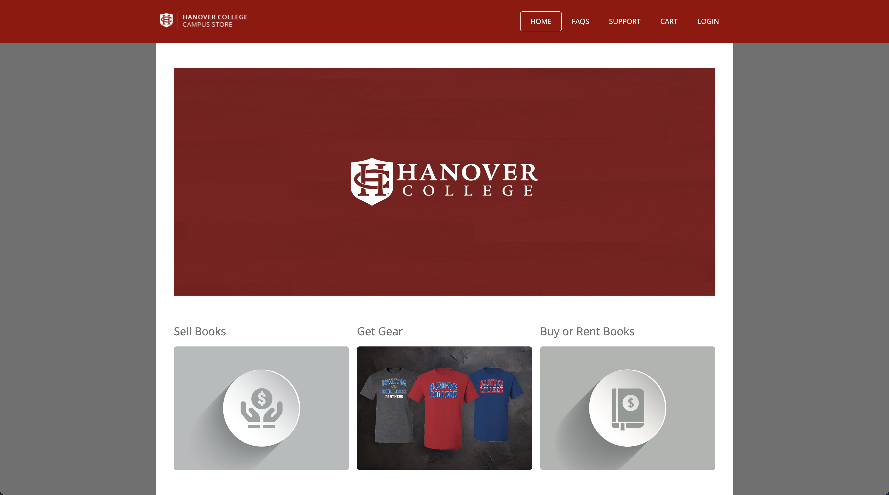
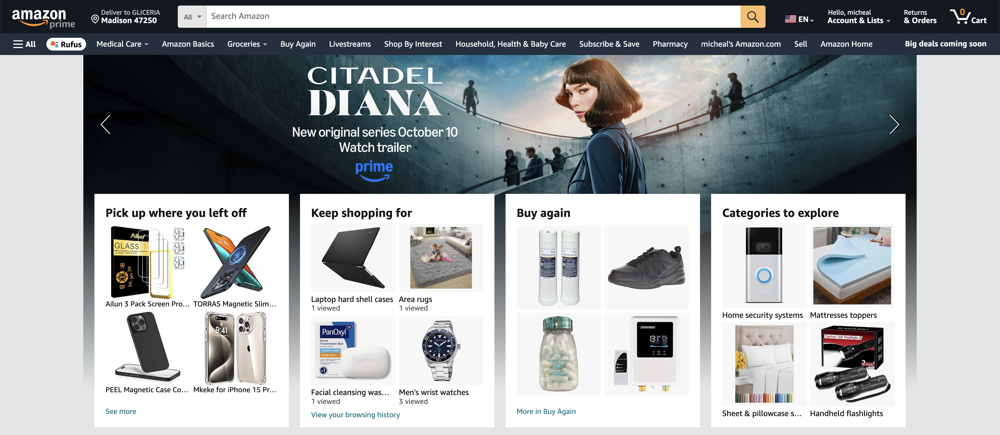
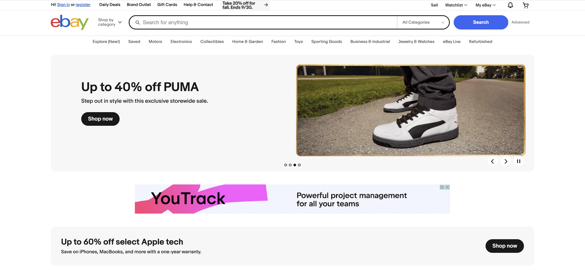
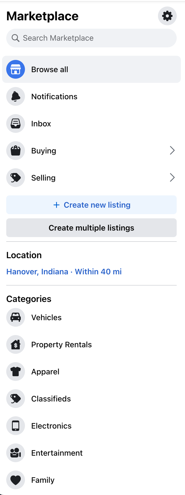

# **Panther Thrift Shop Web Application**

### **Introduction**
The **Panther Thrift Shop** web application aims to provide a convenient, campus-specific platform where students can buy and sell used or new items, encouraging recycling and affordable exchanges. The platform focuses on ease of use, allowing students to browse, buy, and sell goods such as clothing, shoes, appliances, room decor, and textbooks directly through the application. By catering exclusively to students, this project enhances accessibility, trust, and community engagement.

### **Project Features**
The Panther Thrift Shop will incorporate several key features aimed at improving the buying and selling experience for users:

1. **Product Categories**:
    - Items will be organized into specific categories such as:
        - Men's Clothing (Shirts, Pants, Shoes)
        - Women's Clothing (Shirts, Pants, Shoes)
        - Appliances
        - Room Decoration
        - Textbooks, and more.

2. **Product Listings and Images**:
    - Sellers can upload multiple images of their products, offering a detailed view of item conditions and quality.

3. **Seller Review System**:
    - Buyers can leave feedback and reviews for sellers, promoting trust and accountability in transactions.

4. **Shopping Cart**:
    - Buyers will have the option to add multiple items to their shopping cart, simplifying the purchasing process.

5. **Real-Time Chat**:
    - A built-in real-time chat feature will allow buyers and sellers to communicate directly about product details, negotiations, and logistics.

6. **Transaction Status Updates**:
    - **Seller Mark as Sold**: Once an item has been purchased, the seller can mark the product as "Sold" to avoid future inquiries.
    - **Buyer Mark as Received**: After completing a transaction and receiving the item, buyers can mark the product as "Received," confirming the completion of the deal.

7. **Flexible Payment Options**:
    - While the platform does not handle payment processing directly, transactions can be arranged through external methods such as Venmo, cash, or any other preferred payment method. This flexibility enables buyers and sellers to make secure transactions outside of the platform.

8. **Responsive Web Design**:
    - The application will be accessible through various browser platforms.

### **Technologies**

1. **React (JavaScript Library)**:
    - React is a powerful front-end JavaScript library used to build user interfaces, especially single-page applications. It allows for fast and efficient rendering of dynamic content, making it ideal for building interactive and responsive web applications like Panther Thrift Shop. React’s component-based architecture will help in organizing and managing different parts of the application (e.g., product listings, chat functionality, cart system) more effectively, allowing for reusable and maintainable code. Compared to Angular, which has a steeper learning curve and is more opinionated, React offers greater flexibility and a more active community, making it a better fit for this project.

3. **Next.js (React Framework)**:
    - Next.js is a powerful React framework that enables a hybrid approach of server-side rendering (SSR) and client-side rendering (CSR), similar to Amazon's architecture. This combination is beneficial for Panther Thrift Shop as it requires both SSR for features like product listings and SEO optimization, and CSR for real-time functionalities such as chat and user authentication. Next.js provides faster page loads, improved scalability, and a robust development environment, making it easier to build complex features. Compared to Gatsby, which mainly focuses on static site generation, Next.js offers more versatility for implementing a broader range of features.

3. **JavaScript (Programm
4. ing Language)**:
    - JavaScript will be used as the primary programming language for the application. It is essential for creating interactive features such as real-time chat, form validation, dynamic updates (e.g., adding items to the cart without refreshing the page), and other behaviors that enhance user experience. JavaScript also seamlessly integrates with React, enabling smooth operation of all interactive elements of the web app. While TypeScript offers additional type safety, JavaScript’s simplicity and flexibility make it a more accessible choice for rapid development in this context.
   

4. **HTML (Markup Language)**:
    - HTML (HyperText Markup Language) is the standard language used to structure the content of web pages. For **Panther Thrift Shop**, HTML will be used to define the structure of the web pages, such as product categories, product listings, forms, and user interfaces. It ensures that the content is properly displayed and accessible to users across different browsers.

5. **CSS (Cascading Style Sheets)**:
    - CSS is responsible for the visual styling of the web application. In **Panther Thrift Shop**, CSS will be used to design an attractive and responsive layout, ensuring that the web app looks clean, modern, and functions well on browsers. Features such as product galleries, navigation menus, and chat windows will be visually enhanced through CSS to improve user engagement and experience.

6. **WebStorm (Editor)**:
   - WebStorm is a powerful IDE designed for JavaScript development, providing a wide range of tools and features that will streamline the development process for Panther Thrift Shop. It offers advanced code editing, refactoring tools, debugging, and seamless integration with Git, React, and Next.js. WebStorm’s intelligent code completion, error detection, and built-in support for web technologies (HTML, CSS, JavaScript) will help ensure efficient, error-free development, improving both the speed and quality of the project.

### **Similar Solutions** 
1. **Hanover College Campus Store**
   - Slingshot is the current Hanover College partner, managing the campus store and providing services such as book acquisition, delivery, and mailroom operations. Slingshot primarily offers brand new Hanover College merchandise and manages the buyback of used books. However, they purchase these books at a low price compared to their high resale value. The Panther Thrift Shop is being developed as a complementary platform to address these limitations by allowing students to buy and sell a wider variety of used items at fair prices, creating a more affordable and inclusive marketplace for the campus community [^1].
     

2. **Amazon**
   - Amazon serves as a comprehensive e-commerce platform that offers features like categorized product listings, user reviews, shopping cart functionality, and flexible payment options, all designed to enhance the user experience. These features are closely related to those planned for the Panther Thrift Shop, which aims to provide a similar, yet campus-specific, marketplace where students can buy and sell items such as clothing, appliances, and textbooks. By implementing features like detailed product categories, a seller review system, and a responsive design, Panther Thrift Shop will mirror Amazon’s successful model on a smaller scale, fostering a trusted and efficient community-driven exchange platform tailored to student needs [^2].
     

3. **Ebay**
   - eBay is similar to Panther Thrift Shop in that it facilitates the buying and selling of various items, including clothing, electronics, and textbooks. Both platforms enable users to list products with multiple images, providing detailed views to potential buyers. However, while Panther Thrift Shop is campus-specific and focuses on peer-to-peer exchanges among Hanover College students, eBay operates on a global scale, catering to a much broader audience. This difference impacts the level of personalization and security; Panther Thrift Shop’s restricted user base offers a more trusted environment for transactions. Additionally, eBay handles payment processing through platforms like PayPal and charges fees on sales, whereas Panther Thrift Shop allows users to negotiate payments independently, offering flexibility and avoiding transaction fees [^3].
     

4. **Facebook Marketplace**
   - Facebook Marketplace and Panther Thrift Shop are similar in that they both enable local buying and selling of items like clothing, furniture, and textbooks. Both platforms allow users to communicate directly through messaging about product details and transactions. However, while Facebook Marketplace is available to anyone in a given geographic area, Panther Thrift Shop is exclusive to Hanover College students, fostering a tighter-knit, more secure community. Unlike Facebook Marketplace, which does not have a dedicated review system for sellers, Panther Thrift Shop includes a feedback mechanism to promote trust and accountability. Additionally, Panther Thrift Shop's category organization specifically addresses student needs, such as room decor and textbooks, which may be less emphasized on Facebook Marketplace [^4].
     

5. **Chegg**
   - Chegg and Panther Thrift Shop both cater to students, particularly in the realm of textbooks. Chegg offers a structured platform for buying, renting, and selling textbooks, with a focus on academic resources. Panther Thrift Shop similarly allows students to sell textbooks but in a peer-to-peer format, potentially at lower costs and without standardized pricing. Chegg’s model includes features like eTextbooks and online tutoring, which Panther Thrift Shop does not offer, as its primary goal is to serve as a marketplace for a variety of student needs, including clothing and household items, rather than solely academic support. Chegg’s handling of payment and shipping is more integrated, while Panther Thrift Shop provides flexibility by enabling students to arrange transactions independently [^5].
     

6. **Poshmark**
   - Poshmark is similar to Panther Thrift Shop in that it allows users to sell clothing and accessories through detailed listings with multiple images. Both platforms enable direct communication between buyers and sellers, promoting transparent transactions. However, Poshmark’s primary focus is on fashion, and it includes features like shipping labels and a standardized payment system, which Panther Thrift Shop does not provide. Panther Thrift Shop, in contrast, supports a broader range of product categories such as appliances and textbooks, catering to the diverse needs of the campus community. This versatility and the absence of mandatory transaction fees make Panther Thrift Shop a more flexible and cost-effective solution for students [^6].
     

7. **OfferUp**
   - OfferUp shares similarities with Panther Thrift Shop by focusing on local buying and selling of items, making it easy for users to browse and post listings. Both platforms do not process payments directly, allowing users to coordinate payment and pickup details independently. However, OfferUp’s broader community reach means it serves a more diverse audience beyond just students, whereas Panther Thrift Shop’s exclusive focus on Hanover College fosters a more secure and familiar environment. OfferUp is optimized for mobile use, while Panther Thrift Shop ensures accessibility across both mobile and desktop platforms, catering to a wider range of user preferences. Additionally, Panther Thrift Shop’s review system and community-centric features like real-time chat enhance trust and usability within the student body [^7].
     

# **Sources**
[^1]:Hanover College Campus Store, “Slingshot,” Hanover College, Indiana. Available: [Slingshot](https://hanover.slingshotedu.com/). Released: Jan. 1, 2020. [Accessed: Sept. 20, 2024].

[^2]: Amazon, “Amazon.com: Online Shopping for Electronics, Apparel, Computers, Books, DVDs & more.” Available: [Amazon](https://www.amazon.com/). Released: July 5, 1994. [Accessed: Sept. 20, 2024].

[^3]: eBay, “eBay: Electronics, Cars, Fashion, Collectibles & More.” Available: [eBay](https://www.ebay.com/). Released: Sept. 3, 1995. [Accessed: Sept. 20, 2024].

[^4]: Facebook, “Facebook Marketplace: Buy and Sell Locally.” Available: [Facebook Marketplace](https://www.facebook.com/marketplace/). Released: Oct. 3, 2016. [Accessed: Sept. 20, 2024].

[^5]: Chegg, “Chegg: Textbook Rental, Homework Help, Tutoring & Study Solutions.” Available: [Chegg](https://www.chegg.com/). Released: 2005. [Accessed: Sept. 20, 2024].

[^6]: Poshmark, “Poshmark: Buy and Sell Fashion, Home Decor, Beauty & More.” Available: [Poshmark](https://poshmark.com/). Released: 2011. [Accessed: Sept. 20, 2024].

[^7]: OfferUp, “OfferUp: Buy. Sell. Simple.” Available: [OfferUp](https://offerup.com/). Released: 2011. [Accessed: Sept. 20, 2024].

